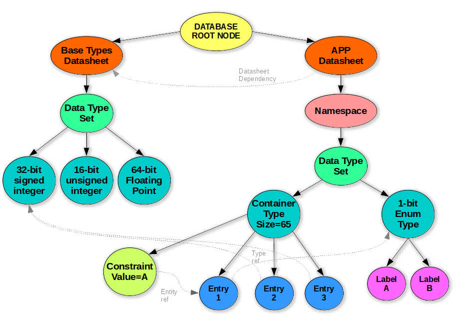
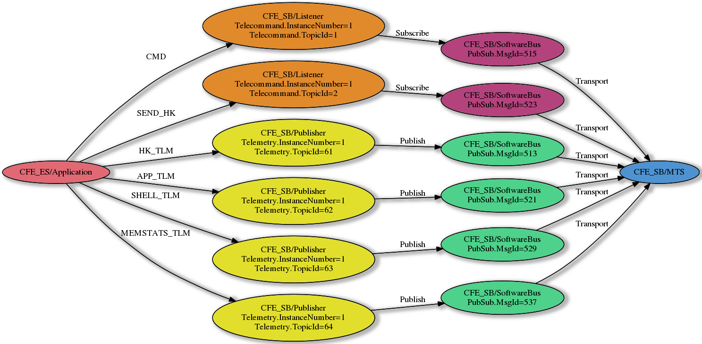

% Guide to SEDS tool and Document Object Model {#edsdom}

# Introduction

This document is intended to provide an overview of the operation of the SOIS
electronic data sheet (SEDS) processing tool operation, and act as a guide for
developers interested in using these tools for flight software integration.

To allow for both efficient and extensible processing of SEDS files, the tool is
broken into many smaller constituent parts, each of which perform some specific
task as part of the overall goal of facilitating integration of EDS information
with flight software applications.

## General Design and Organization

SEDS files, by nature, are application-agnostic.  They simply describe an interface and the
necessary binary format(s) to communicate with another entity.  Therefore, any tool to read
process those files should also be application agnostic, at least to start.

One of the goals of the SEDS tool was for wide applicability to a variety of applications, and
_not_ to assume that the target environment would always be the Core Flight System (cFS) and
the associated software bus.

To achieve this, the tool itself is intentionally very minimal.  Essentially, the base tool
only provides the ability to read and parse a set of XML files into a Document Object
Model (DOM), along with an execution environment in which scripts can be executed against
that DOM.  Very little functionality is "built in" to the tool, it is all achieved using
additional scripts and loadable modules.

This DOM is conceptually similar to the Javascript DOM of HTML documents in a web browser,
but very different in terms of usage and implementation as it represents a very different
type of document.

## Invocation

A CMake build recipe is included with the source code to build the basic executable using
CMake.  Once built, the tool is executed by supplying a set of XML files and processing
scripts on the command line, such as:

```shell
$ sedstool MyEDSFile1.xml MyEDSFile2.xml MyScript1.lua MyScript2.lua ...
```

A few command line options are recognized:

- `-v` : Increase verbosity level.  Use twice for full debug trace.
- `-D NAME=VALUE` : Sets the symbolic NAME to VALUE for preprocessor substitutions


However, this tool is generally _not_ intended to be executed manually in a standalone
installation, but built and executed as part of a larger application build system, such
as Core Flight System (cFS).

The tool will first read _all_ the supplied XML files and build a DOM tree, and then it
will invoke each Lua script _in alphanumeric order_ of filename.  Ordering is
very important, as each script can build upon the results of the prior scripts.  To preserve
the intended order of operations, each script supplied with this tool contains a two digit
numeric prefix, which indicates the correct position in the set.  This way, when scripts are
executed in a simple alphanumeric order, and this will always produce the correct result.
Furthermore, additional scripts can be added into the sequence simply by choosing an appropriate
prefix number, without needing to specify explicit dependencies or complicated rules.


## Processing Scripts

As mentioned earlier, the entirety of SEDS file processing is actually delegated into various
processing scripts, each of which targets a specific objective.   These objectives can be
to simply analyze the DOM tree and identify relationships that future processing scripts can
leverage, or it could be generation of a certain type of output file, or anything else.

A number of processing scripts are implemented to extract data from SEDS files and produce
useful output for flight software systems development.  However, it is not limited to
flight software; much of the logic is actually very generic.


### Application-independent Basic Reading and Preprocessing

The basic tool in the `tool` subdirectory only provides an execution enviroment and
some preprocessing scripts.  It handles the task of reading the XML files and building
a "Document Object Model" (DOM) tree in memory.

This initial DOM building step is supplemented with six additional processing scripts.
Preprocessing operations are performed, relationships and dependencies between objects
will be resolved, and the final size of all data types will be calculated.  This derived
information is stored in the DOM along with the original information from the XML files
for use by later stages of processing.

__Scripts Provided__

| Name                  | Objective                                                     |
|-----------------------|---------------------------------------------------------------|
| `parse_defines`       | Preprocessing of design-time parameters                       |
| `resolve_refs`        | Establish linkages between DOM nodes                          |
| `resolve_sizes`       | Determine the complete size and binary layout of all objects  |
| `resolve_constraints` | Establish linkages of constraint entities                     |
| `resolve_components`  | Create instances of components based on instance rules        |
| `write_resolved_xml`  | Exports "fully resolved" SEDS XML files to other tools        |

**Important**: None of the scripts here make any assumption about the programming language
or application that the EDS will be integrating with.  Scripts in this section are entirely
generic.


### C Language Data Type Database

The intermediate processing stage is contained in the `edslib`  subdirectory.  It is focused
on providing a C language interface for handling and basic interpretation of the data types
described in EDS files.  It is important to note that this is _not_ specific to any particular
application; any C/C++ software application of any type can utilize the EdsLib bindings to
interact with EDS objects.

The goal of this processing stage is to generate a database with sufficient information
such that any EDS-defined binary object can be converted into a native "C" representation or
vice versa.  This basic data handling functionality is critical to all subsequent operations,
including later processing stages as well as flight software and ground tools.

To acheive this, the directory provides a runtime library in the `fsw` subdirectory which can
be linked with any C source code that needs to interpret or manipulate objects defined in EDS.

Additionally this contains a set of scripts that operate within the EDS tool to generate compatible
header files and source files that work with the `edslib/fsw` runtime library.  Each EDS-defined
data type has a corresponding `typedef` in the generated C header files.  Additionally, mapping objects
are generated which establish the relationship between the EDS-defined binary object (packed bits using
EDS-defined encoding), and the native representation, which require appropriate alignment padding
and uses a machine-specific encoding.

The `fsw` runtime library provides consistent and reliable conversion between the EDS-defined
representation and the native representation of an object, using the generated mapping/conversion
tables.  This foundation also acts as the basis for bindings to other higher level languages.  Two
such bindings are provided, to Lua and JSON, in the `lua` and `json` directories, respectively.
These leverage third party libraries that convert between "C" language values and the corresponding
script languge.  Additional bindings can be easily added, such as Ruby or Python, as necessary.

__Scripts Provided__

| Name                       | Objective                                                         |
|----------------------------|-------------------------------------------------------------------|
| `write_headers`            | Write C header files reflecting EDS types                         |
| `write_datatypedb_objects` | Write C database files mapping C structures to EDS objects        |
| `write_displaydb_objects`  | Write C database files with data display information (names, etc) |
| `build_mission_edsdb`      | Write makefiles to build objects                                  |

**Important:** These are focused only on data types and basic data interpretation in the C language.
Application-specific usage semantics are outside the scope of this database, and are handled in the
later stage(s) of processing.  To maximize reuse potential of the tools and artifacts at this stage,
these do not assume any particular application semantics, and care is taken to ensure that the
generated headers and library files do not depend on anything beyond standard C headers/libraries.


### Core Flight System Application-specific Database

The final processing stage resides in the `cfecfs/missionlib` directory. In this stage the
EDS interface and component definitions are interpreted to create a second database object
which contains information regarding how the data structures are actually used in the Core
Flight System (cFS).

**Important:** All prior stages have operated in an entirely abstract, application-agnostic
manner.  This is the stage that is intended to "specialize" the EDS information for use with
cFS, and in particular the Software Bus (SB) interface.

This generates the mappings between EDS interface definitions and the associated Software
Bus routing information.  The software bus routes messages based on an abstract identifier
known as a "Message Id".  This value is not, and cannot be directly defined in EDS due to
variations in how this value is actually defined.  This mapping requires additional information
which is outside the scope of EDS, mainly:

1) Procedures to extract or store abstract "Message Id" values within messages, which
   may be based on multiple different fields in the encapsulation headers, and may involve
   an arithmetic translation and/or table lookup

2) Procedures to map EDS-defined "Topic Id" values into "Message Id" values which are
   routable by the Software Bus entity.

Either of these procedures may be arbitrarily complex, and may also be driven by historical
mission needs and therefore are not easily defined as a reference to a single field within
the EDS-defined data type(s) being used.

To solve this issue, the translation functions above are implemented in a small "C" library
using standard C code, referred to as the `runtime` library.  This small library has minimal
dependencies and therefore can be shared between all tools and software using EDS in
conjunction with cFS.

This approach ensures that the same logic will be used by all tools, with no repeated
logic between applications.  It also allows the SEDS tool itself to use the same implementation
via the dynamic loading mechanism; in other words, the library can be dynamically loaded
into the SEDS tool framework, and the functions can be called by the scripts to create
accurate mapping tables.

__Scripts Provided__

| Name                       | Objective                                                         |
|----------------------------|-------------------------------------------------------------------|
| `cfe_sb_parameter_map`     | Determine parameter values for all interface instances            |
| `cfe_sb_dispatch_tables`   | Write C source files for dispatching software bus messages        |
| `build_cfe_sb_interfacedb` | Write makefiles to build objects                                  |
| `write_intf_heirarchy`     | Create dot files to graphically view the interface structure      |


## Extensibility

The initial set of scripts provided with the tool can be supplemented by any number of
mission- or application-specific EDS processing scripts.  They can be injected into the
environment simply by including them on the invocation command line.

To obtain the correct execution sequence, scripts should be prefixed with a two digit
number (similar to the existing scripts) that will indicate its position in the set.
Note that it is OK for numbers to be duplicated, so long as there is no specific
dependency relationship between the two scripts.  If one script needs to execute
before the other, scripts would need to be re-numbered to ensure correct ordering.


# SEDS Tool Runtime Enviornment

All SEDS processing operations are implemented in Lua, and the basic tool provides an
execution environment for these Lua scripts, calling each user-specified script in sequence.

The tool starts by loading all the standard Lua libraries, as well as a `SEDS` library that
provides additional functions useful for EDS file processing.  Additionally, EDS XML files
will be loaded to generate the _initial_ document object model (DOM) tree, described below,
before any processing scripts are invoked.

## SEDS Library

The `SEDS` library is accessed from scripts via a table object of the same name in the
global Lua environment.  Using a single table object in this fashion is a customary Lua practice
to isolate various libraries from each other, effectively giving each library its own namespace
for objects and methods.  This is the same paradigm used for all of the standard libraries, and
should offer compatibility with other 3rd party Lua libraries as well, provided that they all follow
this recommended practice.

This top-level `SEDS` object in turn contains several objects and helper functions to assist with
EDS file processing, and also acts as a top level object to track the state of SEDS processing in
general.  The specific methods and objects are documented below in the respective areas.


## Document Object Model (DOM)

The DOM lies at the core of all EDS processing and is an essential element to all EDS
processing logic.  This is an in-memory "summary" of all data from all the EDS XML files
in use.  The DOM is fully cross-linked so that it can be traversed in many different
ways as necessary by the processing script operations.

This section covers the general structure of the document object model.  Each node/entity with
the DOM has specific properties and methods associated with it as well.  These properties and
methods are documented in the reference section.

The DOM is intentionally _not_ read-only, but rather a dynamic object.  As scripts execute,
they may extract information or relationships from the DOM, or they may extend the DOM with
additional information that can in turn be used by subsequent scripts.

**Important**: The DOM is affected by the EDS tool scripts being executed, so the properties
associated with any given entity at any given time is dependent on the scripts that have
executed previously.  The initial DOM will be generated purely from the information in the EDS
XML files, but it can be supplemented with additional information thereafter.

### Example Definition Tree

The following graphic depicts a very simple DOM tree structure, to illustrate the possible
node relationships within the DOM tree.  The DOM is a typical "one-to-many" style tree, where
each node has a single parent and may have multiple children.



This would represent a theoretical mission containing two EDS XML files: a "base type" EDS,
containing only a `DataTypeSet` with common types, and an "application" datasheet, with a `DataTypeSet`
inside a `Namespace` which defines a container data type and an enumerated data type.

- The enumeration has two labels, "A" and "B"
- The container has three entries, named "1", "2", and "3"
- Container entry "1" is of the enumerated type
- Container entries "2" and "3" are 32-bit signed integer values (from the base types sheet)
- The container has a constraint, indicating that entry "1" is constrained to the value "A"

Each of the DOM nodes are constructed in memory basically reflecting the structure of the EDS XML files
that defined the entities.  These parent/child relationships are exactly the same as the source XML file
and are depicted by solid black lines.  However, the diagram also illustrates some of the additional
relationships that are determined by the SEDS preprocessing scripts, and these are illustrated with
dashed gray lines:

- The size of the container is calculated to be 65 bits (a single bit enum followed by two 32-bit integers)
- The "type" property of the container entry DOM nodes is a reference back to the respective DOM node
  for the actual EDS data type definition
- The "entry" property constraint DOM node contains a reference to the actual container entry referenced
- The top-level "application" datasheet depends on the "base types" datasheet, since entities within it
  use data type(s) defined by the base type EDS.

**Note**: This is only a simplified example for the purposes of illustrating the basic DOM structure
and type of relationships that exist between DOM nodes.  This is _not_ a complete picture; even a "small"
DOM would potentially have thousands of nodes and interconnects.  Even in the graphic, some XML layers and
connections have been consolidated for the sake of illustration.

### Example Interface Tree

In order to make use of the interfaces described in EDS, the tool also generates an "interface heirarchy"
similar in structure to the DOM tree shown above.  While the DOM tree focuses on _definitions_, this tree
describes actual _instances_ of the components described in EDS.



**NOTE**: The arrows depict a "requirement" relationship, not a direction of message flow.

On the left side is the "high level" or application component, which in turn requires functional interfaces
for commands and telemetry, which are based on Topic IDs.  These in turn utilize an access interface to the
Software Bus, which is based on a Message ID.  Finally, this requires a subnetwork level message passing
interface, which is the right side of the diagram.


# Property and Function Reference Guide

This section describes the specific properties, objects, functions, and methods available within the
SEDS library and DOM node objects.

## Conventions

For object values, the type indicated in this document is one of the following values.  In Lua code, these
map to one of the fundamental Lua types, but may be more specific:

| Object Type      | Lua Type        | Description                                                      |
|------------------|-----------------|------------------------------------------------------------------|
| string           | string          | A normal string value                                            |
| boolean          | boolean         | A true/false value; missing or nil values treated as "false"     |
| integer          | number          | A Lua number that should always be an integer value              |
| array            | table           | A table with sequential integer keys; uses `ipairs()` to iterate |
| map              | table           | A lookup table arbitrary keys; uses `pairs()` to iterate         |
| multipart        | table           | A table with a fixed/known set of keys with certain meanings     |
| treenode         | userdata        | Entity within the Document Object Model                          |
| filehandle       | userdata        | An output file                                                   |
| edslib           | userdata        | Lua library object for an EDS type library                       |
| memreq           | userdata        | Memory requirements object (see description)                     |
| sohandle         | userdata        | Dynamically loaded shared object handle                          |
| symhandle        | userdata        | A specific symbol reference from a dynamic shared object         |


## DOM Tree Node Methods

The DOM tree nodes implement several object-oriented methods, depending on the type of node.  In Lua
these are invoked using the "object call" syntax, for example:

```Lua
    node:method(args)
```

For reference, the methods applicable to normal DOM tree nodes are implemented in `seds_tree_methods.lua`
and the methods specific to instance nodes are in `seds_instance_methods.lua`.  More complete documentation
of the method arguments and return values are available in documentation within those files.  The methods
are summarized here for convenience.  Note that some methods are also implemented in "C" code.


| Method               | Purpose                                                                    |
|----------------------|----------------------------------------------------------------------------|
| `error`              | Generates an error message based on the current node                       |
| `warning`            | Generates a warning message based on the current node                      |
| `get_properties`     | Gets an array of property keys defined for the current node                |
| `get_xml_location`   | Gets the full XML file and line of the definition of this node             |
| `get_qualified_name` | Gets the fully-qualified SEDS type name for the given node                 |
| `get_flattened_name` | Gets the node name suitable for use in a "flattened" namespace             |
| `find_first`         | Find the first child node matching filter criteria                         |
| `find_parent`        | Find a parent/ancestor node of the matching filter criteria                |
| `find_reference`     | Find another node by name using current node as the starting context       |
| `find_entity`        | Find an entity within the given EDS container                              |
| `iterate_members`    | Iterate entities within a container or interface                           |
| `iterate_children`   | Iterate children of the current node matching filter criteria              |
| `iterate_subtree`    | Iterate all nodes beneath the current node matching filter criteria        |
| `mark_reference`     | Marks a dependency relationship between two DOM nodes                      |
| `get_references`     | Gets a list of DOM objects which reference the given DOM object            |
| `debug_print`        | Dump all node details on the console for debugging purposes                |


## SEDS Library Values

In addition to the functions described later, the `SEDS` global contains object values to track the state
of the processing as a whole.  These are objects created within the `SEDS` global table by the initial
tool initialization and preprocessing scripts.  Note that later scripts can add additional objects as
necessary to track their own state, so the global table may contain additional values as well.

| Object Name             | Type     | Description                                                  |
|-------------------------|----------|--------------------------------------------------------------|
| `root`                  | treenode | Root of the EDS Document Object Model tree                   |
| `highlevel_interfaces`  | array    | Instances of Application level interface(s)                  |
| `lowlevel_interfaces`   | array    | Instances of Subnetwork level interface(s)                   |
| `commandline_defines`   | map      | Name/Value pairings supplied via the command line `-D`       |
| `checksum_table`        | map      | Look up DOM data types nodes based on their checksum value   |

### Objects added by later scripts

These values are added by the `edslib` stage of processing, not by the base tool.  They
are worth noting here as they may be relevant to additional script development.

| Object Name             | Type     | Description                                                  |
|-------------------------|----------|--------------------------------------------------------------|
| `edsdb`                 | sohandle | Shared object handle for the "EdsDB" library (data type DB)   |
| `edslib`                | edslib   | Lua library bindings to the "EdsDB" object                    |


### Console output and reporting functions

The following functions simplify the process of reporting status information to the user console.
Thes can abstract different output/terminal environments and add context information (e.g. to format
error messages such that IDE environments can automatically link to the relevant source file), and
also give the user control over how the messages are ultimately displayed:

| Function              | Purpose                                                       |
|-----------------------|---------------------------------------------------------------|
| `debug`               | Generate a "Debug" message to the console                     |
| `info`                | Generate an "Information" messsage                            |
| `warning`             | Generate a "Warning" message                                  |
| `error`               | Generate an "Error" message                                   |
| `fatal`               | Generate a "Fatal" message, **causes tool to abort**          |
| `get_warning_count`   | Gets a running total of warning messages generated            |
| `get_error_count`     | Gets a running total of error messages generated              |

Note that "debug" and "info" messages are hidden by default.  Visibility of these messages is
controlled by the `-v` command line option or value of the `VERBOSE` environment variable.

| Command Line Options  | `VERBOSE` environment value   | Message Visibility            |
|-----------------------|-------------------------------|-------------------------------|
| `-v`                  | 1                             | Add "Information" messages    |
| `-v -v`               | >= 2                          | All messages                  |


### General support/helper functions

This set of functions is provided as general purpose utilities:

| Helper Function      | Purpose                                                       |
|----------------------|---------------------------------------------------------------|
| `to_safe_identifier` | Convert any string into a safe identifer for generated code   |
| `to_macro_name`      | Convert any value into a macro name for C source files        |
| `load_plugin`        | Loads a dynamic shared object (`.so`) extension into the tool |
| `attach_db`          | Instantiate an EdsLib-Lua binding instance based on the DB    |
| `luafy_refs`         | Convert a string into a Lua code chunk suitable for `load`    |
| `execute_tool`       | Executes an external tool via `os.execute`                    |
| `sorted_keys`        | Given any table, return an iterator of keys in sorted order   |
| `get_define`         | Find a symbolic value via `${}` preprocessing substitutions   |

**NOTE**: The `sorted_keys` function operates on any standard Lua table and it is not specific
to EDS processing in any way.  It is included here because the standard Lua table iteration
function `pairs()` does not return the keys in a predicable or consistent order.  However,
ordering is often important when generating EDS output files, as one typically wants to produce
consistent output between subsequent executions of the tool, to avoid superflous file changes.
Obtaining the keys to a table in a consistent order is an important tool for acheving this goal.


### Output file generation functions

Many SEDS processing scripts generate additional output files to be used by flight software or
other entities.  These library functions and methods aid in the output of these files.

| SEDS Function   | Purpose                                                                    |
|-----------------|----------------------------------------------------------------------------|
| `to_filename`   | convert any name value into an appropriate filename for output             |
| `output_close`  | Close a previously opened file handle                                      |
| `output_open`   | Open a new output file using supplied filename.  File handle is returned.  |

The filehandle returned from `SEDS.output_open` contains the following additional methods:

| File Handle Method    | Purpose                                                              |
|-----------------------|----------------------------------------------------------------------|
| `write`               | Appends a line of content to the output file                         |
| `flush`               | Flushes any pending output to the file                               |
| `add_whitespace`      | Adds the indicated number of lines of whitespace                     |
| `start_group`         | Opens a group using the specified string, increasing indent level    |
| `end_group`           | Closes a group using the specified tag, decreasing indent level      |
| `append_previous`     | Appends a line ending symbol (e.g. comma) to the previous `write`    |
| `section_marker`      | Creates a "banner-style" comment to mark sections of the output file |
| `add_documentation`   | Creates a "documentation-style" comment (e.g. doxygen for C files)   |

**NOTE**: The `append_previous` method is used assist when generating line-oriented lists, where
every line except the last element would have a comma.  In general, it is not known which
type of punctuation to use on a given line until the _next_ line is generated.  This necessitates
either putting the punctuation at the beginning of the next line, which is less readble, or by
"peeking" ahead, which is tedious.  This method is a compromise that allows the line punctuation
to be modified after the initial write.


### DOM node filtering functions

General purpose filtering functions accept a single DOM node reference and return a boolean
value indicating whether the node matches the filtering criteria.  A number of commonly-used
filter criteria are available as predefined filters.  Additionally, a "factory" function is
provided to simpify the process of creating new filters which match any arbitrary node type.

| Filter Factory Function    | Purpose                                                         |
|----------------------------|-----------------------------------------------------------------|
| `create_nodetype_filter`   | Creates a filter function which matches the nodetypes specified |

| Predefined Filter Function | Matching Criteria                                               |
|----------------------------|-----------------------------------------------------------------|
| `component_filter`         | Matches all `Component` nodes                                   |
| `declintf_filter`          | Matches `Interface` nodes within a Declared Interface Set       |
| `referredintf_filter`      | Matches `Interface` nodes within a Provided or Required Set     |
| `command_argument_filter`  | Matches `Argument` nodes on commands                            |
| `instancerule_filter`      | Matches `InstanceRule` nodes                                    |
| `container_entry_filter`   | Matches nodes within the EntryList of a container               |
| `constraint_filter`        | Matches all constraint nodes (Type/Value/Range)                 |
| `index_datatype_filter`    | Matches data types compatible with an `indextype` attribute     |
| `any_datatype_filter`      | Matches any data type node                                      |
| `container_filter`         | Matches container data types                                    |
| `numeric_datatype_filter`  | Matches any numeric data type (integer or floating point)       |
| `concrete_datatype_filter` | Matches any non-abstract data type                              |
| `subentity_filter`         | Matches any data type which "contains" other entities           |
| `intf_entry_filter`        | Matches parameters or arguments                                 |


### Low level DOM manipulation and debug functions

These functions allow the DOM tree to be extended with additional nodes.  Typical scripts would
usually _not_ need to perform this type of activity, but these are included for completeness:

| Function                   | Purpose                                                         |
|----------------------------|-----------------------------------------------------------------|
| `new_size_object`          | Returns a new "memory requirement" (`memreq`) calculator object |
| `new_tree_object`          | Returns a new DOM node object of the given type                 |
| `new_component_instance`   | Returns a new DOM instance node object                          |
| `get_property_history`     | Returns a table describing the history of a given DOM property  |


## Tree Node Property Reference

Each node in the DOM tree have their own methods and properties associated with them.  The base
tool creates the tree and intializes a basic set of properties on every node, based on the contents
of the XML source and the determined relationships between nodes.

**NOTE**: Properties are dynamic and can be added, modified, or removed by any processing script.
It is good practice to handle the possibility of a `nil` property value in Lua scripts, even for
properties that should always be present.

## Initial property set from XML parsing

This set of properties is created by the XML parser when the original source files are read, and should
be present on every node in the DOM:

| Property Name     | Type     | Purpose                                                                     |
|-------------------|----------|-----------------------------------------------------------------------------|
| `parent`          | treenode | The parent node of the this node                                            |
| `subnodes`        | array    | An array of child nodes attached to this node                               |
| `id`              | integer  | A unique sequence number assigned to this node during the reading process   |
| `longdescription` | string   | The contents of the XML `LongDescription` sub element, if present           |
| `xml_filename`    | string   | The full path to the XML source file that defined this node                 |
| `xml_linenum`     | integer  | The line number in the XML source file that defined this node               |
| `xml_cdata`       | string   | Any arbitrary "character data" that was inside the XML node, if present     |
| `xml_element`     | string   | Contains the original XML element type of this node                         |
| `xml_attrs`       | map      | Unprocessed attribute/value pairs from the XML (all values are _strings_)   |
| `xml_attrname`    | map      | Maps EDS property names back to original XML attribute names                |


## Properties added during preprocessing

The preprocessing stage takes the "raw" data from the XML file (stored in the `xml_attrs` property) and
performs any necessary placeholder substitution operations to determine the actual/correct value for all
properties going forward.  This is always the first step of processing, as all other processing will use the
real values of these attributes.

| Property Name     | Type     | Purpose                                                                     |
|-------------------|----------|-----------------------------------------------------------------------------|
| `attributes`      | map      | Attribute/value pairs with `${}` replacements made                          |


## Properties added during reference resolution

The reference resolution is where all the references to other objects and values are identified.  Initially,
all data from the XML file is in the form of strings.  This step converts these strings into the appropriate
reference to the real value.  Most importantly, for `type` references, this searches the DOM tree for the
actual definition, and adds a property that refers directly to the other DOM node.  In other cases, this simply
converts the string value into the appropriate type (e.g. a number) and verifies that the value is acceptable.


| Property Name     | Type      | Purpose                                                                     |
|-------------------|-----------|-----------------------------------------------------------------------------|
| `name`            | string    | The name of this node, typically from the `name` or `label` attribute       |
| `type`            | treenode  | Reference to DOM node corresponding to the `type` XML attribute             |
| `basetype`        | treenode  | Reference to DOM node corresponding to the `basetype` XML attribute         |
| `interface`       | treenode  | Reference to DOM node corresponding to the `interface` XML attribute        |
| `datatyperef`     | treenode  | Reference to DOM node corresponding to the `datatyperef` XML attribute      |
| `component`       | treenode  | Reference to component DOM node for instance objects                        |
| `rule`            | treenode  | Reference to the rule DOM node for instance objects and interface mappings  |
| `references`      | multipart | Other DOM node(s) which refer to this object (back references - see note)   |

**Note**: The `references` property is usually not accessed directly, but should be queried via the
`get_references` method described later.


A number of other properties are identified here, which only apply to certain types of DOM nodes:


| Property Name    | Type      | Applies to   | Purpose                                                        |
|------------------|-----------|--------------|----------------------------------------------------------------|
| `resolved_range` | multipart | ranges       | The minimum and maximum of the discrete value type or range    |
| `last_value`     | integer   | enumerations | The final value of an enumerated type                          |
| `export`         | boolean   | defines      | Whether the definition should be exported from the tool        |
| `size`           | integer   | dimensions   | The dimension size corresponding to the `size` attribute       |
| `sizeinbits`     | integer   | encodings    | The encoding size corresponding to the `sizeInBits` attribute  |
| `length`         | integer   | strings      | The string length corresponding to the `length` attribute      |
| `value`          | integer   | enum labels  | The enumerator label corresponding to the `value` attribute    |
| `encoding`       | string    | encodings    | The encoding corresponding to the `encoding` attribute         |


## Properties added during size resolution

The next stage of processing is intended to compute the actual binary layouts and sizes of all objects in
the EDS DOM tree.

| Property Name     | Type     | Purpose                                                                     |
|-------------------|----------|-----------------------------------------------------------------------------|
| `resolved_size`   | memreq   | Contains the final calculated size of the object itself                     |
| `max_size`        | memreq   | Contains maximum possible size of a derived container type or interface     |
| `has_derivatives` | boolean  | Set "true" if the type is used as a base for other types                    |
| `is_signed`       | boolean  | Set "true" integer or enumeration type can take on negative values          |
| `decode_sequence` | array    | The complete sequence of sub-items within the object (including base types) |
| `total_elements`  | integer  | The total number of elements within an array (product of all dimensions)    |

### Memory Requirement object properties and method

The `memreq` userdata object, which is used to calculate and store the size of an object, contains several
internal methods and properties of its own.

Properties of `memreq` objects are:

| Property Name  | Type     | Purpose                                                                          |
|----------------|----------|----------------------------------------------------------------------------------|
| `bits`         | integer  | Total number of bits occupied by the object, per EDS-specified encoding          |
| `bytes`        | integer  | Estimated number of bytes for typical native encoding in C                       |
| `alignment`    | integer  | Estimated alignment requirement for typical native encoding in C                 |
| `is_packed`    | boolean  | Set to "true" in cases where the object EDS and native representations may match |
| `checksum`     | string   | The 64-bit checksum represented as an ASCII-encoded hexadecimal number           |

Methods on `memreq` objects are:

| Property Name  | Purpose                                                                                  |
|----------------|------------------------------------------------------------------------------------------|
| `add`          | Appends to the current object, increasing the size accordingly                           |
| `union`        | Determines the union of two sizes, selecting the greater of the memory requirements      |
| `multiply`     | Multiplies the size by a given amount, such as for arrays                                |
| `flavor`       | Modifies the checksum without changing the size                                          |
| `pad`          | Incorporates EDS padding into the object; this affects the bit size and checksum only    |

**NOTES:**

1) all properties are read-only, at least directly.  They are only modified via method calls above.
2) the "checksum" is a 64-bit integer value.  This exceeds the quantity which can be reliably stored in a Lua number,
   so it is reprensented as a hexadecimal ASCII string instead.  The string is always 16 characters long.
   

## Properties added during constraint resolution

The next stage of processing is intended to resolve the entity reference within a `Constraint` element.  Note
this is _not_ performed earlier during the normal reference resolution step since entry references can point
entries within base types.  Therefore this specific type of resolution is delayed until after the sizes are
resolved, and in particular the `decode_sequence` property, which was calculated previously, is leveraged here
to locate a specific entity.

| Property Name     | Type     | Purpose                                                                     |
|-------------------|----------|-----------------------------------------------------------------------------|
| `resolved_entry`  | treenode | Contains reference corresponding to the `entry` XML attribute               |


